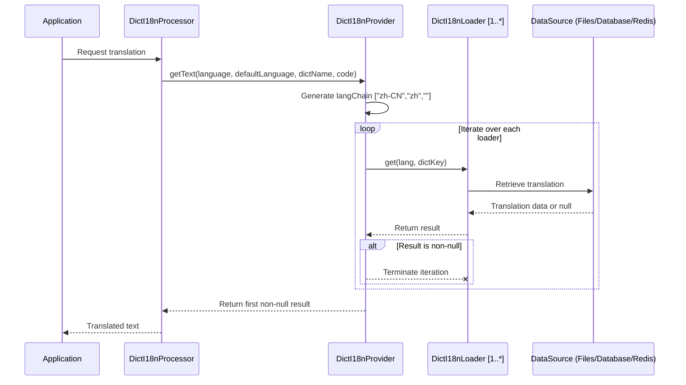

# 🧩 Dict-I18n Loader Instructions

## 📘 Overview

`dict-i18n` supports multiple dictionary loading methods, allowing developers to flexibly choose adapters based on
system requirements. Loaders act as bridges between external data sources (e.g., files, databases, Redis) and the
system, responsible for reading dictionary content from various sources, converting it into a standardized format, and
making it available for system calls.

All loaders follow a unified interface design, with built-in priority control, caching mechanisms, and format
extensibility to ensure compatibility and efficiency across diverse scenarios. The system not only includes
preconfigured loaders for common use cases but also supports custom extensions via a plug-in architecture. This
flexibility enables seamless adaptation to internationalization scenarios of all scales (from small applications to
large distributed systems) and performance requirements, providing a robust solution for multilingual dictionary
loading.

Loader Architecture:  


Loader Query Flow:



## 🧱 Loader Structure and Extension Mechanism

The core workflow of a loader typically includes the following key stages:

1. **Data Reading**: Extract raw dictionary data from a specified source (e.g., files, databases, Redis).
2. **Data Parsing**: Convert heterogeneous raw data into the system’s unified standard data structure.
3. **Caching Support** (optional): Implement local caching for loaded results to reduce performance overhead from
   repeated loading.
4. **Source Merging**: In multi-loader scenarios, support data merging and overriding based on configured priorities,
   executing loading logic sequentially.

All loaders adhere to the `DictI18nLoader` interface specification and support extending functionality via extension
components (see details below).

## 📚 Built-in Loaders

| Loader Name         | Description                                       | Configuration Key | Caching Supported |  
|---------------------|---------------------------------------------------|-------------------|-------------------|  
| **File Loader**     | Loads dictionaries from yml / properties files    | `file`            | ✅                 |  
| **Database Loader** | Loads dictionaries via SQL queries                | `sql`             | ✅                 |  
| **Redis Loader**    | Loads dictionary entries from Redis               | `redis`           | ❌                 |  
| **Declared Loader** | Manually declares dictionary descriptions in code | `declared`        | ❌                 |  

Loaders share the following common configuration items:

| Configuration | Type    | Default | Description                  |  
|---------------|---------|---------|------------------------------|  
| `enabled`     | boolean | `true`  | Whether to enable the loader |  
| `ignoreCase`  | boolean | `true`  | Whether to ignore case       |  

Additionally, each loader has specific configurations that can be enabled or disabled as needed.
See [Configuration Instructions](../config/Configuration_Instructions.md) for details.

### Loader Selection Guide

- Static dictionaries / testing scenarios: Prefer the `declared` or `file` loader.
- Distributed systems / high-frequency access: Prefer the `redis` loader.
- High dynamic update requirements: Prefer the `sql` loader (combined with database update mechanisms).

## 📂 File Loader (`file`)

* **Function**: Reads dictionary entries from local or remote YML/Properties files.
* **Caching**: The file loader loads all data from files into memory at startup and does not support custom caching
  strategies.
* **Workflow**:

  **Startup Phase**: The file loader scans the `resource` directory for yml or properties files matching the naming
  pattern (`dict_i18n/dict_{locale}` or `dict_i18n/dict`). It caches all dictionary translation data in memory (no
  custom strategies supported). If subsequent files contain duplicate dictionary keys, they overwrite previous data.

  **Query Phase**: Dictionary translations are read directly from memory during each lookup.

   ```mermaid  
   sequenceDiagram
    title File Loader Loading and Query Flow
    participant App as Application
    participant Loader as FileDictI18nLoader
    participant Parser as DictFileParser
    participant Strategy as DictFileParseStrategy
    participant Cache as Non-expired cache
    Note over App, Cache: Application Startup Phase
    App ->> Loader: Initialize
    Loader ->> Loader: loadAll()
    Loader ->> Loader: loadResourcesFromPattern()
    Loader ->> Loader: Find all matching files by pattern
    loop For each resource
        Loader ->> Loader: extractLangFromFilename()
        Loader ->> Loader: Determine language code from filename<br/>(e.g., dict_en.yml --> "en")
        Loader ->> Parser: parse(resource)
        Parser ->> Strategy: getStrategy(resource)
        Strategy ->> Strategy: Select YAML or Properties strategy by file extension
        Strategy ->> Parser: parse(resource)
        Parser -->> Loader: List<DictInfo>
        Loader ->> Cache: Store dictionary entries
    end
    Note over App, Cache: Query Phase
    App ->> Loader: get(lang, dictKey)
    Loader ->> Cache: Look up value
    Cache -->> App: Dictionary value
    App -->> App: Optional<String>  
   ```  

### 🧩 File Format Extension

The file loader uses
the [DictFileParser](../../../dict-i18n-loader/dict-i18n-loader-core/src/main/java/cn/silwings/dicti18n/loader/parser/DictFileParser.java)
component for data parsing. By default, it supports YML and Properties files.

To extend support for custom formats (e.g., JSON, XML), implement
the [DictFileParseStrategy](../../../dict-i18n-loader/dict-i18n-loader-core/src/main/java/cn/silwings/dicti18n/loader/parser/strategy/DictFileParseStrategy.java)
interface:

```java  
public interface DictFileParseStrategy {

    boolean supports(Resource resource);

    List<DictInfo> parse(Resource resource);
}  
```  

Simply inject the implementation class into the Spring container, and the system will automatically recognize and enable
the parsing strategy.

## 🧮 Database Loader (`sql`)

* **Function**: Queries dictionary data from database tables.
* **Caching**: Uses in-memory caching with a default implementation based on `google.guava`.
* **Workflow**:

  **Startup Phase**:

    - The SQL loader initializes:
    - If schema configuration is enabled, it automatically creates necessary tables and indexes in the database (
      supports MySQL, PostgreSQL, SQLite).
    - If preload configuration is enabled, it scans the `resource` directory for yml or properties files matching the
      pattern (`dict_i18n/dict_{locale}` or `dict_i18n/dict`), converts translation data into INSERT statements, and
      inserts them into the database.

  **Query Phase**:

    - If caching is enabled, the loader first reads from the cache; on cache misses, it queries the database and stores
      results (including null values) in the cache.
    - If caching is disabled, it queries the database directly and returns results.

      > Additional Note: For unsupported databases, manually create the table structure using the following SQL as a
      reference:
      >   ```sql  
      >    CREATE TABLE dict_i18n  
      >    (  
      >    id          BIGINT AUTO_INCREMENT PRIMARY KEY,  
      >    dict_key    VARCHAR(512)  NOT NULL,  
      >    lang        VARCHAR(10)   NOT NULL,  
      >    description VARCHAR(1024) NOT NULL,  
      >    enabled     TINYINT       NOT NULL DEFAULT 1 COMMENT 'Enable or not: 1-Enable, 0-Disable',  
      >    UNIQUE KEY uidx_dicti18n_dictkey_lang (dict_key, lang)  
      >    ) ENGINE=InnoDB;  
      >   CREATE INDEX idx_dicti18n_dictkey ON dict_i18n (dict_key);  
      >   CREATE INDEX idx_dicti18n_lang ON dict_i18n (lang);  
      >   ```  

  ```mermaid  
    sequenceDiagram
    title SQL Loader Loading and Query Flow
    participant App as Application
    participant SchemaInit as DictI18nSchemaInitializer
    participant Preload as DictI18nSqlDataInitializer
    participant Parser as DictFileParser
    participant Cache as DictI18nLoaderCacheProvider
    participant Loader as SqlDictI18nLoader
    participant DB as Database (MySQL/PostgreSQL/SQLite)
    participant Resources as Resource Files
    Note over App, Resources: Application Startup Phase
    App ->> SchemaInit: Initialize SQL loader
    SchemaInit ->> SchemaInit: Check if schema is enabled
    alt Schema enabled
        SchemaInit ->> DB: Execute table creation statements
        DB -->> SchemaInit: Operation successful
        DB -->> SchemaInit: Operation successful
    end

    Preload ->> Preload: Check if preload is enabled
    alt Preload enabled
        Preload ->> Resources: Scan for pattern-matching files
        Resources -->> Preload: Return list of matching resource files
        loop Process each resource file
            Preload ->> Parser: Parse file content
            Parser -->> Preload: Return parsed dictionary data
            Preload ->> DB: Execute INSERT statements
            DB -->> Preload: Operation successful
        end
    end

    Preload -->> Loader: Loader ready
    Note over App, DB: Query Phase
    App ->> Loader: Request translation data (langChain, dictKey)
    Loader ->> Cache: Check if caching is enabled
    alt Caching enabled
        Loader ->> Cache: Fetch data from cache (langChain, dictKey)
        Cache -->> Loader: Return cached data (may be null)
        alt Cache hit (including null values)
            Loader -->> App: Return cached data
        else Cache miss
            Loader ->> DB: Execute query
            DB -->> Loader: Return query result (may be null)
            Loader ->> Cache: Store result in cache (supports null values)
            Cache -->> Loader: Caching complete
            Loader -->> App: Return query result
        end
    else Caching disabled
        Loader ->> DB: Execute query
        DB -->> Loader: Return query result
        Loader -->> App: Return query result
    end  
  ```    

### 🧠 Caching Mechanism

The SQL loader enables caching by default (since version 1.0.2) to reduce frequent database access and improve
performance.

To customize caching strategies (e.g., integrating Redis for distributed caching, configuring定时刷新规则), extend
the [DictI18nLoaderCacheProvider](../../../dict-i18n-loader/dict-i18n-loader-core/src/main/java/cn/silwings/dicti18n/loader/cache/DictI18nLoaderCacheProvider.java)
interface:

```java  
public interface DictI18nLoaderCacheProvider {

    Optional<String> getDesc(String lang, String key, DictDescGetter descGetter);
}  
```  

Register the implementation class as a Spring Bean, and the system will automatically use the custom cache provider
instead of the default in-memory cache.

## 🧰 Redis Loader (`redis`)

* **Function**: Retrieves stored dictionary data from Redis.
* **Caching**: No additional caching layer is added since Redis itself provides high-performance distributed caching.
* **Workflow**:

  **Startup Phase**: If preload configuration is enabled, the Redis loader scans the `resource` directory for yml or
  properties files matching the pattern (`dict_i18n/dict_{locale}` or `dict_i18n/dict`), and bulk-writes translation
  data to Redis using Lua scripts.

  **Query Phase**: The loader directly fetches translation data from Redis and returns it.

  ```mermaid  
  sequenceDiagram
    title Redis Loader Loading and Query Flow
    participant App as Application
    participant Preload as DictI18nRedisDataInitializer
    participant Parser as DictFileParser
    participant Loader as RedisDictI18nLoader
    participant Redis as Redis
    participant Resources as Resource Files
    Note over App, Resources: Application Startup Phase
    App ->> Preload: Initialize Redis loader
    Preload ->> Preload: Check if preload is enabled
    alt Preload enabled
        Preload ->> Resources: Scan for pattern-matching files
        Resources -->> Preload: Return list of matching resource files
        loop Process each resource file
            Preload ->> Parser: Parse file content
            Parser -->> Preload: Return parsed dictionary data
            Preload ->> Preload: Generate Lua script (for bulk insertion)
            Preload ->> Redis: Execute Lua script to insert data
            Redis -->> Preload: Data insertion complete
        end
    end

    Preload -->> Loader: Loader ready
    Note over App, Redis: Query Phase
    App ->> Loader: Request translation data (langChain, dictKey)
    Loader ->> Redis: Fetch translation data from Redis
    Redis -->> Loader: Return query result (may be null)
    Loader -->> App: Return translation data  
  ```  

## 🧾 Declared Loader (`declared`)

* **Function**:  
  Enables the framework to fetch descriptions directly from Java objects by implementing
  the [DeclaredDict](../../../dict-i18n-loader/dict-i18n-loader-declared/src/main/java/cn/silwings/dicti18n/loader/declared/dict/DeclaredDict.java)
  interface or adding a `getDesc` method to classes implementing the `Dict` interface.
* **Use Cases**: Suitable for static dictionaries, dictionaries requiring dynamically generated descriptions via code
  logic, or quick configuration in testing scenarios.
* **Note**: The declared loader ignores language information when reading descriptions. Implement language logic in
  `getDesc` if needed.
* **Workflow**:

  **Startup Phase**: The declared loader scans the runtime classpath to identify all enums and Java Beans implementing
  the `Dict` interface. These classes are instantiated and cached in memory.

  **Query Phase**: After retrieving a `Dict` instance from memory:

    - If it implements `DeclaredDict`, its `getDesc()` method is called directly.
    - If it does not implement `DeclaredDict`, the loader uses reflection to find a `getDesc()` method; if found, it is
      invoked.
    - If it is an enum type, return the name of the enum value;
    - return empty;

   ```mermaid  
   sequenceDiagram
    title Declared Loader Loading and Query Flow
    participant App as Application
    participant Loader as DeclaredDictI18nLoader
    participant Scanner as DictScanner
    participant DictImpl as Dict/DeclaredDict implementation<br/>(Enum/Java Bean)
    participant Cache as Non-expired cache
    Note over App, Cache: Application Startup Phase
    App ->> Loader: Initialize Declared loader
    Loader ->> Scanner: Scan runtime classpath
    Scanner ->> Scanner: Find all classes implementing Dict<br/>(enums and Java Beans)
    Scanner -->> Loader: Return list of matching classes
    loop Process each Dict implementation
        Loader ->> DictImpl: Instantiate class
        DictImpl -->> Loader: Return instance
        Loader ->> Cache: Cache instance in memory
        Cache -->> Loader: Caching complete
    end

    Loader -->> Loader: Loader ready
    Note over App, Cache: Query Phase
    App ->> Loader: Request translation data (dictKey)
    Loader ->> Cache: Fetch Dict instance from memory
    Cache -->> Loader: Return Dict instance
    Loader ->> Loader: Check if it implements DeclaredDict
    alt Is DeclaredDict implementation
        Loader ->> DictImpl: Call getDesc() method
        DictImpl -->> Loader: Return description
    else Not a DeclaredDict implementation
        Loader ->> Loader: Use reflection to find getDesc()
        alt getDesc() found
            Loader ->> DictImpl: Reflectively call getDesc()
            DictImpl -->> Loader: Return description
        else getDesc() not found
            alt is an enum type
            Loader->>Loader: Return the name of the enum value
        else Is not an enum type
            Loader->>Loader: Return empty
        end
    end
    Loader -->> App: Return translation result  
   ```  

Example `DeclaredDict` implementation:

```java  
public enum PaymentType implements DeclaredDict {

    WECHAT {
        @Override
        public String getDesc() {
            return "Wechat";
        }
    },
    ALIPAY {
        @Override
        public String getDesc() {
            return "AliPay";
        }
    };

    @Override
    public String dictName() {
        return "payment_type";
    }

    @Override
    public String code() {
        return this.name();
    }
}  
```  

## 🧩 Overview of Loader-Related Extension Components

| Component Interface           | Description                                                                                         | Applicable Loaders |  
|-------------------------------|-----------------------------------------------------------------------------------------------------|--------------------|  
| `DictI18nLoader`              | Defines a unified interface standard for all dictionary loaders; the base interface for all loaders | All loaders        |  
| `DictFileParseStrategy`       | Extends dictionary file parsing capabilities to support more formats (e.g., json, xml)              | file / redis / sql |  
| `DictI18nLoaderCacheProvider` | Provides custom caching implementations; can replace default caching strategies                     | sql                |  

### Custom Loaders

The most extensible feature is creating custom dictionary loaders to load dictionary data from different sources. Let's
implement a simple custom loader that fetches dictionary data from a REST API:

**Core Interface:**

```java  
public interface DictI18nLoader {

    /**
     * Loader name, must be unique  
     */
    String loaderName();


    /**
     * Get translation by language and key  
     *
     * @param lang    lowercase language code  
     * @param dictKey dictionary key  
     * @return translation text  
     */
    Optional<String> get(String lang, String dictKey);
}  
```  

**Implementing the Custom Loader:**

```java  

@Component
public class RestApiDictI18nLoader implements DictI18nLoader {

    private final RestTemplate restTemplate;
    private final String apiUrl;
    private final Map<String, Map<String, String>> cache = new ConcurrentHashMap<>();

    public RestApiDictI18nLoader(final RestTemplate restTemplate, @Value("${dict-i18n.loader.rest.url}") String apiUrl) {
        this.restTemplate = restTemplate;
        this.apiUrl = apiUrl;
    }

    @Override
    public String loaderName() {
        // Unique name for this loader  
        return "rest";
    }

    @Override
    public Optional<String> get(final String lang, final String dictKey) {
        if (null == lang || null == dictKey) {
            return Optional.empty();
        }

        // Get dictionary data for this language, load if necessary  
        final Map<String, String> langDict = this.cache.computeIfAbsent(lang, this::loadDictionaryForLanguage);

        // Return translation if available  
        return Optional.ofNullable(langDict.get(dictKey));
    }

    private Map<String, String> loadDictionaryForLanguage(final String lang) {
        try {
            // Call REST API to get dictionary data for this language  
            final String url = this.apiUrl + "?lang=" + lang;
            final DictionaryResponse response = this.restTemplate.getForObject(url, DictionaryResponse.class);

            if (null != response && response.isSuccess()) {
                return response.getData();
            }
        } catch (Exception e) {
            // Handle exceptions  
        }
        return new HashMap<>();
    }

    // Simple response class for the API  
    private static class DictionaryResponse {
        private boolean success;
        private Map<String, String> data;

        // Getters, setters...  

        public boolean isSuccess() {
            return success;
        }

        public Map<String, String> getData() {
            return data;
        }
    }
}  
```  

After implementation, remember to adjust the configuration file to execute the custom loader in the desired order.

## 🧠 Loader Order Control (`loader-order`)

You can explicitly declare the execution priority of loaders using the `dict-i18n.loader-order` configuration. Example:

```yaml  
dict-i18n:
  loader-order:
    - redis
    - sql
    - file
    - declared  
```  

Loaders listed earlier take precedence: If a higher-priority loader cannot find dictionary data, the system
automatically invokes subsequent loaders until valid data is retrieved or all loaders are exhausted.

**Note**: This mechanism implements multi-level overriding and supplementation of dictionary data through sequential
execution, ensuring the system can flexibly adapt to query requirements across diverse data sources in complex
scenarios.

| [< Starter Instructions](../starter/Starter_Instructions.md) | [Configuration Instructions >](../config/Configuration_Instructions.md) |  
|:-------------------------------------------------------------|------------------------------------------------------------------------:|