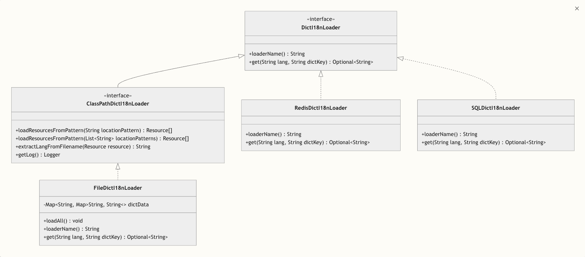
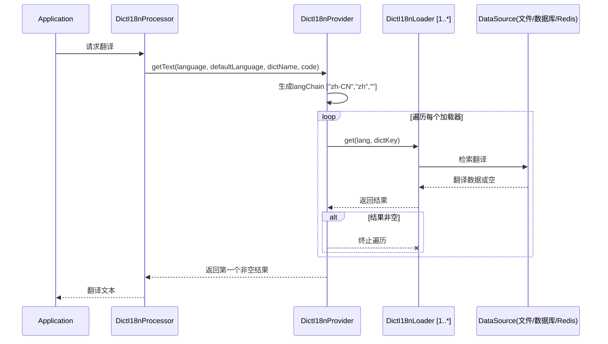

# 🧩 Dict-I18n 加载器（Loader）说明

## 📘 概述

`dict-i18n` 支持多种字典加载方式，开发者可根据系统实际需求灵活选用适配的加载器。加载器作为连接外部数据源（如文件、数据库、Redis等）与系统的桥梁，负责读取各类数据源中的字典内容，并将其标准化转换后供系统调用。

所有加载器均遵循统一接口设计，同时内置优先级控制、缓存机制及格式扩展能力，确保在多样化场景下的兼容性与高效性。系统不仅预设了多种常用加载器，更通过插件化架构支持自定义扩展，可轻松适配不同体量（从小型应用到大型分布式系统）及性能需求的国际化场景，为多语言系统提供灵活且可靠的字典加载解决方案。

加载器架构:


加载器查询流程:



---

## 🧱 加载器结构与扩展机制

加载器的核心运作流程通常包含以下关键环节：

1. **数据读取**：从指定数据源（如文件、数据库、Redis 等）提取字典原始数据；
2. **数据解析**：将异构的原始数据转换为系统统一的标准数据结构；
3. **缓存支持**（可选）：对加载后的结果实施本地缓存策略，以减少重复加载带来的性能损耗；
4. **来源合并**：多加载器场景下支持按配置优先级进行数据合并与覆盖，依序执行加载逻辑。

所有加载器均遵循统一的DictI18nLoader接口规范，同时支持通过扩展组件拓展功能边界（详见下文说明）。

---

## 📚 内置加载器一览

| 加载器名称         | 描述                         | 配置键        | 是否支持缓存 |
|---------------|----------------------------|------------|--------|
| **文件加载器**     | 从 yml / properties 文件中加载字典 | `file`     | ✅      |
| **数据库加载器**    | 通过 SQL 查询加载字典              | `sql`      | ✅      |
| **Redis 加载器** | 从 Redis 中加载字典项             | `redis`    | ❌      |
| **声明式加载器**    | 在类中手动声明字典描述                | `declared` | ❌      |

加载器有如下的公共配置项

| 配置项        | 类型      | 默认值  | 说明        |
|------------|---------|------|-----------|
| enable     | boolean | true | 是否开启当前加载器 |
| ignoreCase | boolean | true | 是否忽略大小写   |

此外,每个加载器都有对应配置项，并可按需开启、禁用, 详见[配置说明](../config/配置说明.md)。

### 加载器选择指南

- 静态字典 / 测试场景：优先选择 declared 加载器或 file 加载器；
- 分布式系统 / 高频访问：优先选择 redis 加载器；
- 动态更新需求高：优先选择 sql 加载器（结合数据库更新机制）。

---

## 📂 文件加载器（file）

* **功能**：支持从本地或远程的 YML、Properties 格式文件中读取字典项。
* **缓存**: file 加载器在项目启动时会加载文件中的全量数据并缓存至内存，且不支持自定义缓存策略。
* **工作流程**:

  项目启动阶段: file 加载器会扫描 resource 目录下符合命名模式（dict_i18n/dict_{locale} 或 dict_i18n/dict）
  的 yml 或 properties 文件，将其中的字典翻译数据全量缓存至内存，不支持自定义策略（若后续加载的文件中存在重复的字典
  key，会覆盖先前的数据）；

  查询阶段: 每次获取字典翻译时直接从内存中读取。

   ```mermaid
   sequenceDiagram
       title 文件加载器加载与查询流程
       participant App as Application
       participant Loader as FileDictI18nLoader
       participant Parser as DictFileParser
       participant Strategy as DictFileParseStrategy
       participant Cache as Non-expired cache
       Note over App,Cache: 项目启动阶段
       App ->> Loader: 初始化
       Loader ->> Loader: loadAll()
       Loader ->> Loader: loadResourcesFromPattern()
       Loader ->> Loader: 根据位置模式查找所有匹配文件
       loop 对于每个资源
           Loader ->> Loader: extractLangFromFilename()
           Loader ->> Loader: 从文件名确定语言代码<br/>(例如: dict_en.yml --> "en")
           Loader ->> Parser: parse(resource)
           Parser ->> Strategy: getStrategy(resource)
           Strategy ->> Strategy: 根据文件扩展名选择YAML或Properties策略
           Strategy ->> Parser: parse(resource)
           Parser -->> Loader: List<DictInfo>
           Loader ->> Cache: 存储字典条目
       end
       Note over App,Cache: 查询阶段
       App ->> Loader: get(lang, dictKey)
       Loader ->> Cache: 查找值
       Cache -->> App: 字典值
       App -->> App: Optional<String>
   ```

### 🧩 文件格式扩展

文件加载器通过 [DictFileParser](../../../dict-i18n-loader/dict-i18n-loader-core/src/main/java/cn/silwings/dicti18n/loader/parser/DictFileParser.java)
组件实现实际的数据解析功能，系统默认已支持 yml 和 properties 格式文件的解析。

若需扩展支持自定义文件格式（如 json、xml
等），可通过实现 [DictFileParseStrategy](../../../dict-i18n-loader/dict-i18n-loader-core/src/main/java/cn/silwings/dicti18n/loader/parser/strategy/DictFileParseStrategy.java)
接口完成：

```java
public interface DictFileParseStrategy {

    boolean supports(Resource resource);

    List<DictInfo> parse(Resource resource);
}
```

实现类只需注入 Spring 容器，系统即可自动识别并启用该解析策略。

---

## 🧮 数据库加载器（sql）

* **功能**：从数据库表中查询字典数据
* **缓存**: 采用内存缓存，默认实现基于 google.guava
* **工作流程**:

  项目启动阶段:

  - sql 加载器先执行初始化操作：
  - 若开启 schema 配置，会自动在数据库中创建必要的表结构及索引，目前支持 MySQL、PostgreSQL、SQLite；
  - 若开启 preload 配置，会扫描 resource 目录下符合命名模式（dict_i18n/dict_{locale} 或 dict_i18n/dict）的 yml 或
    properties 文件，将其中的字典翻译数据转换为 INSERT 语句并插入数据库。

  查询阶段：

  - 若启用缓存，加载器会优先从缓存读取数据；缓存未命中时则查询数据库，并将结果（包括空值）存入缓存；
  - 若未启用缓存，直接查询数据库返回结果。

    > 补充说明：若使用未支持的数据库，可手动创建表结构，参考 SQL 如下：
    >   ```sql
      >    CREATE TABLE dict_i18n
      >    (
      >    id          BIGINT AUTO_INCREMENT PRIMARY KEY,
      >    dict_key    VARCHAR(512)  NOT NULL,
      >    lang        VARCHAR(10)   NOT NULL,
      >    description VARCHAR(1024) NOT NULL,
      >    enabled     TINYINT       NOT NULL DEFAULT 1 COMMENT 'Enable or not: 1-Enable, 0-Disable',
      >    UNIQUE KEY uidx_dicti18n_dictkey_lang (dict_key, lang)
      >    ) ENGINE=InnoDB;
      >   CREATE INDEX idx_dicti18n_dictkey ON dict_i18n (dict_key);
      >   CREATE INDEX idx_dicti18n_lang ON dict_i18n (lang);
      >   ```

    ```mermaid
    sequenceDiagram
    title SQL加载器加载与查询流程
    participant App as Application
    participant SchemaInit as DictI18nSchemaInitializer
    participant Preload as DictI18nSqlDataInitializer
    participant Parser as DictFileParser
    participant Cache as DictI18nLoaderCacheProvider
    participant Loader as SqlDictI18nLoader
    participant DB as Database (MySQL/PostgreSQL/SQLite)
    participant Resources as Resource Files

    Note over App,Resources: 项目启动阶段
    App->>SchemaInit: 初始化SQL加载器
    SchemaInit->>SchemaInit: 检查是否开启schema配置
    alt schema开启
      SchemaInit->>DB: 执行建表语句
      DB-->>SchemaInit: 操作成功
      DB-->>SchemaInit: 操作成功
    end

    Preload->>Preload: 检查是否开启preload配置
    alt preload开启
      Preload->>Resources: 扫描符合模式的文件
      Resources-->>Preload: 返回匹配的资源文件列表
      loop 处理每个资源文件
        Preload->>Parser: 解析文件内容
        Parser-->>Preload: 返回解析后的字典数据
        Preload->>DB: 执行INSERT语句
        DB-->>Preload: 操作成功
      end
    end

    Preload-->>Loader: 加载器准备就绪
    Note over App,DB: 查询阶段
    App->>Loader: 请求翻译数据(langChain, dictKey)
    Loader->>Cache: 检查是否开启缓存
    alt 缓存开启
      Loader->>Cache: 从缓存获取数据(langChain, dictKey)
      Cache-->>Loader: 返回缓存数据(可能为空)
      alt 缓存命中(包括空值)
        Loader-->>App: 返回缓存数据
      else 缓存未命中
        Loader->>DB: 执行查询语句
        DB-->>Loader: 返回查询结果(可能为空)
        Loader->>Cache: 将结果存入缓存(支持空值)
        Cache-->>Loader: 缓存完成
        Loader-->>App: 返回查询结果
      end
    else 缓存未开启
      Loader->>DB: 执行查询语句
      DB-->>Loader: 返回查询结果
      Loader-->>App: 返回查询结果
    end
    ```    

### 🧠 缓存机制

SQL 加载器默认启用缓存（自 1.0.2 版本起），通过减少对数据库的频繁访问来提升系统性能。

若需自定义缓存策略（如结合 Redis
实现分布式缓存、配置定时刷新规则等），可通过实现 [DictI18nLoaderCacheProvider](../../../dict-i18n-loader/dict-i18n-loader-core/src/main/java/cn/silwings/dicti18n/loader/cache/DictI18nLoaderCacheProvider.java)
接口扩展：

```java
public interface DictI18nLoaderCacheProvider {

    Optional<String> getDesc(String lang, String key, DictDescGetter descGetter);
}
```

将实现类注册为 Spring Bean 后，系统会自动使用自定义缓存提供器替换默认的内存缓存实现。

---

## 🧰 Redis 加载器（redis）

* **功能**：从 Redis 中获取存储的字典数据
* **缓存**：因 Redis 本身具备高性能分布式缓存特性，故未额外叠加缓存层
* **工作流程**：

  项目启动阶段: 若开启 preload 配置，Redis 加载器会扫描 resource 目录下符合命名模式（dict_i18n/dict_{locale} 或
  dict_i18n/dict）的 yml 或 properties 文件，将其中的字典翻译数据通过 Lua 脚本批量写入 Redis；

  读取阶段: 加载器直接从 Redis 中获取翻译数据并返回。

  ```mermaid
  sequenceDiagram
  title Redis加载器加载与查询流程
  participant App as Application
  participant Preload as DictI18nRedisDataInitializer
  participant Parser as DictFileParser
  participant Loader as RedisDictI18nLoader
  participant Redis as Redis
  participant Resources as Resource Files
  
  Note over App,Resources: 项目启动阶段
  App->>Preload: 初始化Redis加载器
  Preload->>Preload: 检查是否开启preload配置
  alt preload开启
  Preload->>Resources: 扫描符合模式的文件
  Resources-->>Preload: 返回匹配的资源文件列表
  loop 处理每个资源文件
  Preload->>Parser: 解析文件内容
  Parser-->>Preload: 返回解析后的字典数据
  Preload->>Preload: 生成Lua脚本(用于批量插入)
  Preload->>Redis: 执行Lua脚本插入数据
  Redis-->>Preload: 数据插入完成
  end
  end
  
  Preload-->>Loader: 加载器准备就绪
  Note over App,Redis: 读取阶段
  App->>Loader: 请求翻译数据(langChain, dictKey)
  Loader->>Redis: 从Redis获取翻译数据
  Redis-->>Loader: 返回查询结果(可能为空)
  Loader-->>App: 返回翻译数据
  ```

---

## 🧾 声明式加载器（declared）

* **功能**:
  通过实现 [DeclaredDict](../../../dict-i18n-loader/dict-i18n-loader-declared/src/main/java/cn/silwings/dicti18n/loader/declared/dict/DeclaredDict.java)
  接口，或为 Dict 接口的实现类添加 `getDesc` 方法，使框架可直接调用 Java 对象的方法获取描述信息。
* **使用场景**：适用于静态字典、需通过代码逻辑动态生成描述的字典，或测试场景中需快速配置的字典数据。
* **注意事项**: declared 加载器在读取字典描述时会忽略语言信息, 如有需要可自行在 getDesc 方法中实现。
* **工作流程**:

  项目启动阶段，declared 加载器扫描运行时类路径，筛选出所有实现 Dict 接口的枚举类与 Java Bean；初始化程序会将这些类实例化并缓存至内存。

  查询阶段，加载器从内存中获取 Dict 实例后：

  - 若为 DeclaredDict 实现类，直接调用其 getDesc() 方法；
  - 若非 DeclaredDict 实现类，通过反射查找 getDesc() 方法，找到则调用；
  - 若为枚举，返回枚举值名称;
  - 返回空。

   ```mermaid
   sequenceDiagram
  title Declared加载器加载与查询流程
  participant App as Application
  participant Loader as DeclaredDictI18nLoader
  participant Scanner as DictScanner
  participant DictImpl as Dict/DeclaredDict实现类<br/>(Enum/Java Bean)
  participant Cache as Non-expired cache

  Note over App,Cache: 项目启动阶段
  App->>Loader: 初始化Declared加载器
  Loader->>Scanner: 扫描运行时类路径
  Scanner->>Scanner: 查找所有实现Dict接口的类<br/>(枚举和Java Bean)
  Scanner-->>Loader: 返回匹配的类列表
  loop 处理每个Dict实现类
    Loader->>DictImpl: 实例化类
    DictImpl-->>Loader: 返回实例对象
    Loader->>Cache: 将实例缓存到内存
    Cache-->>Loader: 缓存完成
  end
  
  Loader-->>Loader: 加载器准备就绪
  Note over App,Cache: 查询阶段
  App->>Loader: 请求翻译数据(dictKey)
  Loader->>Cache: 从内存获取Dict实例
  Cache-->>Loader: 返回Dict实例
  Loader->>Loader: 检查是否为DeclaredDict实现类
  alt 是DeclaredDict实现类
    Loader->>DictImpl: 调用getDesc()方法
    DictImpl-->>Loader: 返回描述信息
  else 不是DeclaredDict实现类
    Loader->>Loader: 通过反射查找getDesc()方法
    alt 找到getDesc()方法
      Loader->>DictImpl: 反射调用getDesc()
      DictImpl-->>Loader: 返回描述信息
    else 未找到getDesc()方法
       alt 是枚举类型
            Loader->>Loader: 返回枚举值名称
        else 不是枚举类型
            Loader->>Loader: 返回空
        end    
    end
  end
  Loader-->>App: 返回翻译结果
   ```

DeclaredDict示例实现：

```java
public enum PaymentType implements DeclaredDict {

  WECHAT {
    @Override
    public String getDesc() {
      return "微信";
    }
  },
  ALIPAY {
    @Override
    public String getDesc() {
      return "支付宝";
    }
  };

  @Override
  public String dictName() {
    return "payment_type";
  }

  @Override
  public String code() {
    return this.name();
  }
}
```

---

## 🧩 加载器相关扩展组件总览

| 组件接口                          | 功能描述	                           | 适用加载器              |
|-------------------------------|---------------------------------|--------------------|
| `DictI18nLoader`              | 定义字典加载器的统一接口规范，所有加载器的基础接口       | 所有加载器              |
| `DictFileParseStrategy`       | 扩展字典文件解析能力，支持更多格式（如 json、xml 等） | file / redis / sql |
| `DictI18nLoaderCacheProvider` | 提供自定义缓存实现方案，可替换默认缓存策略           | sql                |

### 自定义加载器

最具扩展性的点是创建自定义字典加载器，以从不同来源加载字典数据, 让我们实现一个从REST API加载字典数据的简单自定义加载器：

核心接口:

```java
public interface DictI18nLoader {

  /**
   * 加载器名称,必须唯一
   */
  String loaderName();


  /**
   * 根据语言和键获取翻译
   *
   * @param lang    小写语言
   * @param dictKey 字典键
   * @return translation 译文
   */
  Optional<String> get(String lang, String dictKey);
}
```

实现自定义加载器:

```java
@Component
public class RestApiDictI18nLoader implements DictI18nLoader {

    private final RestTemplate restTemplate;
    private final String apiUrl;
    private final Map<String, Map<String, String>> cache = new ConcurrentHashMap<>();

    public RestApiDictI18nLoader(final RestTemplate restTemplate, @Value("${dict-i18n.loader.rest.url}") String apiUrl) {
        this.restTemplate = restTemplate;
        this.apiUrl = apiUrl;
    }

    @Override
    public String loaderName() {
        // 此加载器的唯一名称
        return "rest";
    }

    @Override
    public Optional<String> get(final String lang, final String dictKey) {
        if (null == lang || null == dictKey) {
            return Optional.empty();
        }

        // 获取此语言的字典数据，必要时加载
        final Map<String, String> langDict = this.cache.computeIfAbsent(lang, this::loadDictionaryForLanguage);

        // 如果可用，返回翻译
        return Optional.ofNullable(langDict.get(dictKey));
    }

    private Map<String, String> loadDictionaryForLanguage(final String lang) {
        try {
            // 调用REST API获取此语言的字典数据
            final String url = this.apiUrl + "?lang=" + lang;
            final DictionaryResponse response = this.restTemplate.getForObject(url, DictionaryResponse.class);

            if (null != response && response.isSuccess()) {
                return response.getData();
            }
        } catch (Exception e) {
            // 处理异常
        }
        return new HashMap<>();
    }

    // API的简单响应类
    private static class DictionaryResponse {
        private boolean success;
        private Map<String, String> data;

        // Getters, setters...

        public boolean isSuccess() {
            return success;
        }

        public Map<String, String> getData() {
            return data;
        }
    }
}
```

完成后记得调整配置文件使得自定义加载器按需要的顺序执行.

---

## 🧠 加载器顺序控制（loader-order）

你可以通过配置项 `dict-i18n.loader-order` 显式声明加载器的执行优先级顺序，示例配置如下：

```yaml
dict-i18n:
  loader-order:
    - redis
    - sql
    - file
    - declared
```

配置中靠前的加载器将优先生效：当优先级高的加载器未查询到字典数据时，系统会自动调用后续加载器进行补充查询，直至获取到有效数据或遍历完所有加载器。

**说明**：此机制通过顺序执行策略实现字典数据的多层级覆盖与补充，确保系统在复杂场景下能灵活适配不同数据源的查询需求。

| [< 启动器说明](../starter/启动器说明.md) | [配置说明 >](../config/配置说明.md) |
|:-------------------------------|----------------------------:|