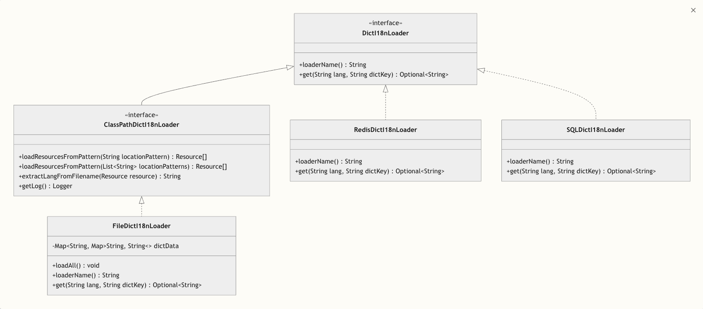
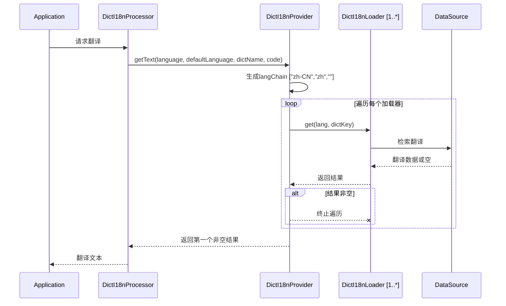

# 🧩 加载器（Loader）说明

## 📘 概述

`dict-i18n` 支持多种字典加载方式，开发者可根据系统需求选择合适的加载器。加载器用于从外部数据源（如文件、数据库、Redis
等）读取字典内容，并将其转换为标准格式供系统使用。每个加载器具备统一接口，并支持优先级控制、缓存机制及格式扩展。

系统内置多种加载器，并通过插件式架构允许自定义扩展，适用于不同体量与性能需求的国际化系统。

加载器架构:


加载器查询流程:



---

## 🧱 加载器结构与扩展机制

加载器通常包括以下几个核心环节：

1. **数据读取**：从指定来源读取字典数据（如文件、SQL、Redis 等）；
2. **数据解析**：解析原始数据格式为标准结构；
3. **缓存支持**（可选）：对加载结果进行本地缓存，减少重复加载；
4. **来源合并**：多个加载器支持合并覆盖，按配置顺序执行。

加载器遵循统一接口 `DictI18nLoader`，并可通过扩展组件增强能力（详见下文）。

---

## 📚 内置加载器一览

| 加载器名称         | 描述                             | 配置键        | 是否支持缓存 |
|---------------|--------------------------------|------------|--------|
| **文件加载器**     | 从 `yml` / `properties` 文件中加载字典 | `file`     | ✅      |
| **数据库加载器**    | 通过 SQL 查询加载字典                  | `sql`      | ✅      |
| **Redis 加载器** | 从 Redis 中加载字典项                 | `redis`    | ❌      |
| **声明式加载器**    | 在类中手动声明字典描述                    | `declared` | ❌      |

加载器有如下的公共配置项

| 配置项        | 类型      | 默认值  | 说明        |
|------------|---------|------|-----------|
| enable     | boolean | true | 是否开启当前加载器 |
| ignoreCase | boolean | true | 是否忽略大小写   |

此外,每个加载器都有对应配置项，并可按需开启、禁用。

---

## 📂 文件加载器（file）

* **功能**：从本地或者远程的 `YML` , `Properties` 文件中读取字典项。
* **缓存**: file加载器在项目启动时从文件加载全量数据并缓存在内存中,因此不支持自定义缓存策略。
* **工作流程**: 项目启动时,file加载器会扫描resource目录下文件名符合`dict_i18n/dict_{locale}`, `dict_i18n/dict`模式的
  `yml`或`properties`文件,并将其中的
  字典翻译数据缓存到内存中(如果后加载的文件中的字典key已经存在,会覆盖之前的数据),之后每次获取字典翻译时从内存中读取.
   ```mermaid
   sequenceDiagram
       title 文件加载器加载与查询流程
       participant App as Application
       participant Loader as FileDictI18nLoader
       participant Parser as DictFileParser
       participant Strategy as DictFileParseStrategy
       participant Cache as Non-expired cache
       Note over App,Cache: 项目启动阶段
       App ->> Loader: 初始化
       Loader ->> Loader: loadAll()
       Loader ->> Loader: loadResourcesFromPattern()
       Loader ->> Loader: 根据位置模式查找所有匹配文件
       loop 对于每个资源
           Loader ->> Loader: extractLangFromFilename()
           Loader ->> Loader: 从文件名确定语言代码<br/>(例如: dict_en.yml --> "en")
           Loader ->> Parser: parse(resource)
           Parser ->> Strategy: getStrategy(resource)
           Strategy ->> Strategy: 根据文件扩展名选择YAML或Properties策略
           Strategy ->> Parser: parse(resource)
           Parser -->> Loader: List<DictInfo>
           Loader ->> Cache: 存储字典条目
       end
       Note over App,Cache: 查询阶段
       App ->> Loader: get(lang, dictKey)
       Loader ->> Cache: 查找值
       Cache -->> App: 字典值
       App -->> App: Optional<String>
   ```

### 🧩 文件格式扩展

文件加载器使用 `DictFileParser` 组件负责实际数据解析。系统默认支持 `yml` 与 `properties` 文件。

如需支持自定义文件格式（如 `json`, `xml`
等），可实现[DictFileParseStrategy](../../../dict-i18n-loader/dict-i18n-loader-core/src/main/java/cn/silwings/dicti18n/loader/parser/strategy/DictFileParseStrategy.java)
接口：

```java
public interface DictFileParseStrategy {

    boolean supports(Resource resource);

    List<DictInfo> parse(Resource resource);
}
```

并注入到Spring容器，系统将自动识别。

---

## 🧮 数据库加载器（sql）

* **功能**：从数据库表中查询字典数据
* **缓存**: sql加载器使用内存缓存,默认的缓存实现为google.guava
* **工作流程**: 项目启动时,sql加载器先执行一些初始化操作,如果开启了`schema`
  ,则sql加载器会在数据库中创建必要的表,并创建索引,目前支持mysql,postgresql,sqlite.之后,如果开启了`preload`,
  则sql加载器会扫描resource目录下文件名符合`dict_i18n/dict_{locale}`, `dict_i18n/dict`模式的`yml`或`properties`
  文件,并将其中的字典翻译数据转换为insert语句插入到数据库中.
  在查询阶段,如果开启了缓存,sql加载器会优先从缓存中读取,如果缓存中不存在则读取数据库,并将结果缓存起来,支持缓存空值.
  - 如果使用的是不支持的数据库,可以手动创建表,表结构如下:
    ```sql
     CREATE TABLE dict_i18n
     (
     id          BIGINT AUTO_INCREMENT PRIMARY KEY,
     dict_key    VARCHAR(512)  NOT NULL,
     lang        VARCHAR(10)   NOT NULL,
     description VARCHAR(1024) NOT NULL,
     enabled     TINYINT       NOT NULL DEFAULT 1 COMMENT 'Enable or not: 1-Enable, 0-Disable',
     UNIQUE KEY uidx_dicti18n_dictkey_lang (dict_key, lang)
     ) ENGINE=InnoDB;
    CREATE INDEX idx_dicti18n_dictkey ON dict_i18n (dict_key);
    CREATE INDEX idx_dicti18n_lang ON dict_i18n (lang);
    ```

  ```mermaid
  sequenceDiagram
  title SQL加载器加载与查询流程
  participant App as Application
  participant SchemaInit as DictI18nSchemaInitializer
  participant Preload as DictI18nSqlDataInitializer
  participant Parser as DictFileParser
  participant Cache as DictI18nLoaderCacheProvider
  participant Loader as SqlDictI18nLoader
  participant DB as Database (MySQL/PostgreSQL/SQLite)
  participant Resources as Resource Files

  Note over App,Resources: 项目启动阶段
  App->>SchemaInit: 初始化SQL加载器
  SchemaInit->>SchemaInit: 检查是否开启schema配置
  alt schema开启
    SchemaInit->>DB: 执行建表语句
    DB-->>SchemaInit: 操作成功
    DB-->>SchemaInit: 操作成功
  end

  Preload->>Preload: 检查是否开启preload配置
  alt preload开启
    Preload->>Resources: 扫描符合模式的文件
    Resources-->>Preload: 返回匹配的资源文件列表
    loop 处理每个资源文件
      Preload->>Parser: 解析文件内容
      Parser-->>Preload: 返回解析后的字典数据
      Preload->>DB: 执行INSERT语句
      DB-->>Preload: 操作成功
    end
  end

  Preload-->>Loader: 加载器准备就绪
  Note over App,DB: 查询阶段
  App->>Loader: 请求翻译数据(langChain, dictKey)
  Loader->>Cache: 检查是否开启缓存
  alt 缓存开启
    Loader->>Cache: 从缓存获取数据(langChain, dictKey)
    Cache-->>Loader: 返回缓存数据(可能为空)
    alt 缓存命中(包括空值)
      Loader-->>App: 返回缓存数据
    else 缓存未命中
      Loader->>DB: 执行查询语句
      DB-->>Loader: 返回查询结果(可能为空)
      Loader->>Cache: 将结果存入缓存(支持空值)
      Cache-->>Loader: 缓存完成
      Loader-->>App: 返回查询结果
    end
  else 缓存未开启
    Loader->>DB: 执行查询语句
    DB-->>Loader: 返回查询结果
    Loader-->>App: 返回查询结果
  end
  ```    

### 🧠 缓存机制

SQL 加载器默认开启缓存(自1.0.2版本起)，以提升性能，避免频繁数据库访问。

如需自定义缓存策略（如结合 Redis
本地缓存、刷新策略等），可实现[DictI18nLoaderCacheProvider](../../../dict-i18n-loader/dict-i18n-loader-core/src/main/java/cn/silwings/dicti18n/loader/cache/DictI18nLoaderCacheProvider.java)：

```java
public interface DictI18nLoaderCacheProvider {

    Optional<String> getDesc(String lang, String key, DictDescGetter descGetter);
}
```

注册该 Bean 后，系统将使用你的缓存提供器替代默认内存缓存。

---

## 🧰 Redis 加载器（redis）

* **功能**：从 Redis 中获取存储的字典数据。
* **缓存**：Redis本身就是高性能分布式缓存,因此未再附加缓存
* **工作流程**：项目启动时,如果开启了`preload`,
  则redis加载器会扫描resource目录下文件名符合`dict_i18n/dict_{locale}`, `dict_i18n/dict`模式的`yml`或`properties`
  文件,并将其中的字典翻译数据转换为lua脚本插入到数据库中.读取阶段,redis加载器直接从redis中获取翻译数据.

  ```mermaid
  sequenceDiagram
  title Redis加载器加载与查询流程
  participant App as Application
  participant Preload as DictI18nRedisDataInitializer
  participant Parser as DictFileParser
  participant Loader as RedisDictI18nLoader
  participant Redis as Redis
  participant Resources as Resource Files
  
  Note over App,Resources: 项目启动阶段
  App->>Preload: 初始化Redis加载器
  Preload->>Preload: 检查是否开启preload配置
  alt preload开启
  Preload->>Resources: 扫描符合模式的文件
  Resources-->>Preload: 返回匹配的资源文件列表
  loop 处理每个资源文件
  Preload->>Parser: 解析文件内容
  Parser-->>Preload: 返回解析后的字典数据
  Preload->>Preload: 生成Lua脚本(用于批量插入)
  Preload->>Redis: 执行Lua脚本插入数据
  Redis-->>Preload: 数据插入完成
  end
  end
  
  Preload-->>Loader: 加载器准备就绪
  Note over App,Redis: 读取阶段
  App->>Loader: 请求翻译数据(langChain, dictKey)
  Loader->>Redis: 从Redis获取翻译数据
  Redis-->>Loader: 返回查询结果(可能为空)
  Loader-->>App: 返回翻译数据
  ```

---

## 🧾 声明式加载器（declared）

* **功能**
  ：通过实现[DeclaredDict](../../../dict-i18n-loader/dict-i18n-loader-declared/src/main/java/cn/silwings/dicti18n/loader/declared/dict/DeclaredDict.java)
  接口，或为Dict接口的实现类添加getDesc方法，使框架能够通过调用 Java 对象的方法获取描述信息。
* **使用场景**：适合静态字典，动态逻辑驱动的字典，或测试场景中快速配置字典数据。
* **注意事项**: declared加载器在读取字典描述时会忽略语言信息
* **工作流程**

示例：

```java
// todo 
```

---

## 🧩 加载器相关扩展组件总览

| 组件接口                          | 功能           | 应用加载器       |
|-------------------------------|--------------|-------------|
| `DictFileParser`              | 用于文件加载器的数据解析 | file        |
| `DictFileParseStrategy`       | 扩展支持更多文件格式   | file        |
| `DictI18nLoaderCacheProvider` | 自定义加载器缓存实现   | sql / redis |

---

## 🧠 加载器顺序控制（loader-order）

你可以通过配置项 `dict-i18n.loader-order` 显式声明加载器执行顺序，例如：

```yaml
dict-i18n:
  loader-order:
    - redis
    - sql
    - file
    - declared
```

靠前的加载器优先生效，后续加载器可以补充或覆盖前者的数据。

| [< 启动器说明](../starter/启动器说明.md) | [配置说明 >](../config/配置说明.md) |
|:-------------------------------|----------------------------:|